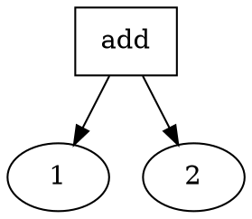
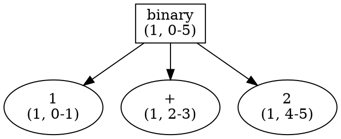
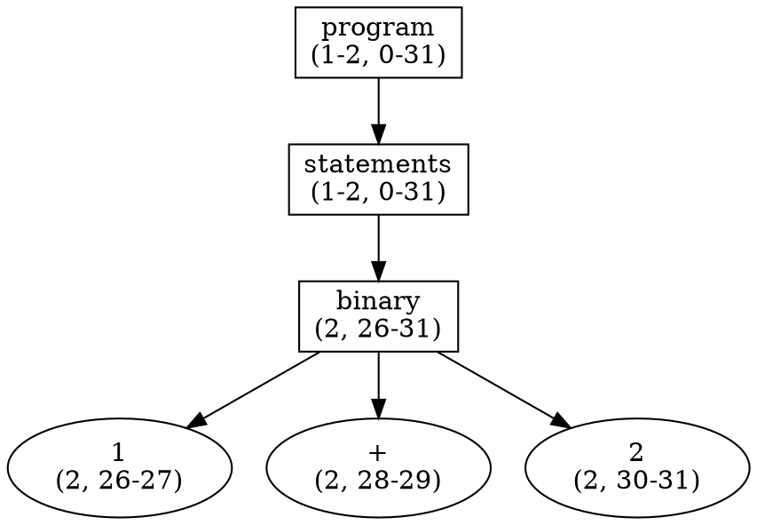

This post is part of a series about how [ruby-syntax-tree/syntax_tree](https://github.com/ruby-syntax-tree/syntax_tree) works under the hood. It's part of an ongoing effort to spread the word about this project, document how it works, and explain some of the internals for anyone interested. This post specifically focuses on Syntax Tree's use of ripper to build a syntax tree. For an overview of this series, see the [introduction post](/2022/02/03/formatting-ruby-part-0).

## Terminology

Before we dig into implementation details, let's have a brief discussion of the term "syntax tree". This term means a lot of different things to different people. Very broadly, it's a data structure used to represent the syntax used in a program.

Usually it loosely resembles a tree, but this can be somewhat misleading in terms of visualization. Personally, I prefer to think of it as more akin to terrace farming, where you have lots of different levels with a lot of plants on each level. That may just be me.

Regardless of how you visualize it, that's about the extent of the definition. It can have as little detail as just the bare information you need to understand the structure, or as much as every single space being accounted for in the program. Let's look at an example.

Below we have a simple program that is adding two integers together:

```ruby
1 + 2
```

Now we want a syntax tree with just enough information to calculate an answer:



This works for some use cases, but doesn't give a lot of information. What if you want to know if there was a space between the operands and the operator? What if you needed to know if the operands were on the same line? These kinds of questions are less important for something like a calculator but are critical for building something like a formatter. Let's try again, but with much more information:



Now we have an additional node in our tree that represents the operator. Additionally we have all of the location information in terms of a (`line number`, `character range`) tuple. Both of these structures are syntax trees. Depending on who you ask, they may be called "abstract syntax trees", or "concrete syntax trees", or even just "parse trees" with various definitions for each. Regardless, the important point is that the second one has a lot more information that we need in order to accurately create a formatter.

## Comments

Let's get into the "why" of using more detailed information to create our syntax tree. As you may have noticed from the heading of this section, we're going to be talking about comments. I remember I had a somewhat funny interaction with one of the creators of [prettier](https://prettier.io) when I mentioned that I was almost done creating the Ruby plugin. I said "I have everything working except comments". His response was that comments were actually more than half the work. He wasn't wrong.

When I was first creating the Ruby plugin, I got the initial work done in a couple of days. It took another year before I got comments working in a consistently correct fashion, and another year on top of that to get them so that they didn't ever break. Why are comments so hard to get right? Let's refer back to our example from the terminology section, but now with some comments.

```ruby
# Add two values together
1 + 2
```

For this first example, it's clear now that we have a comment in our code. We need to represent it _somewhere_ in our syntax tree. But where? If this is the entirety of our program, then we could have a syntax tree that looked something like the following:



We have a `program` node at the top that always represents the root of our syntax tree. We have a child `statements` node that represents a list of statements. The only child of the `statements` node is the `binary` node from our previous example. Here are some logical places where the comment could get attached:

* On the `program` node, since it's the first line of the program before any content.
* On the `statements` node, since it's before any of the statements.
* As a child of the `statements` node, since it could be considered "inside" the statements.
* On the `binary` node, since it's on the line just before the addition.

Now consider if we change the comment and add a newline, like so:

```ruby
# This is a program that adds two numbers together.

1 + 2
```

Does the last bullet point above make sense anymore? Conceptually do you see that comment as being "attached" to the binary node? These kinds of considerations are very important for a formatter as you're attempting to keep the developer's intent intact.

Now consider if there's a comment _inside_ the addition, as in:

```ruby
1 + # this is the first operand
  2
```

This is perfectly valid Ruby. Suspend disbelief with me momentarily and consider that `1` and `2` could actually be method calls, or longer numbers that required explanation, etc. Changing the code above to:

```ruby
1 + 2 # this is the first operand
```

would definitely be incorrect, as it would change future reader's understanding of the code. In this case it's imperative that we know the exact location in source of the operands so that we know where we can place the comment.
