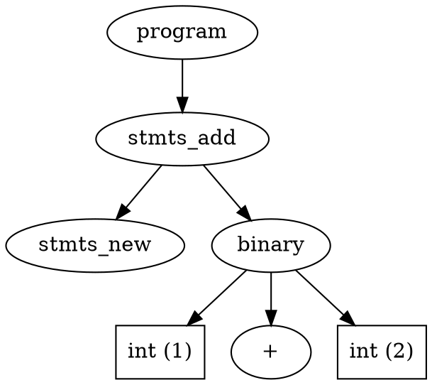

This post is part of a series about how [ruby-syntax-tree/syntax_tree](https://github.com/ruby-syntax-tree/syntax_tree) works under the hood. It's part of an ongoing effort to spread the word about this project, document how it works, and explain some of the internals for anyone interested. This post specifically focuses on ripper, the Ruby standard library used to parse Ruby files.

## History

On October 20th, 2001, [Minero Aoki](https://i.loveruby.net/) released version 0.0.1 of ripper, a streaming Ruby parser. You can still go to his website and download the [first version](https://i.loveruby.net/archive/ripper/ripper-0.0.1.tar.gz) he released.

At the time, Ruby 1.7 had just come out. Ruby was still a tree-walk interpreter (it didn't use an internal bytecode). There was work going on to create Ruby's first bytecode, but it hadn't yet landed on the master branch. Because Ruby's tree was so central to how it functioned, there was a lot of interest in accessing, debugging, and manipulating it. Other projects at the time focused on taking the already parsed tree and returning it to the user, as in [ruth](https://kddnewton.com/parsing-ruby/projects/ruth/readme.txt) and [nodeDump](https://kddnewton.com/parsing-ruby/projects/nodeDump/README.txt).

Ripper took a different approach. Because Ruby's parser was created through [yacc](http://dinosaur.compilertools.net/yacc/), there was a `parse.y` grammar file in the Ruby repository that encapsulated both how the parser was to be created and how the file should be lexically parsed. Ripper took that `parse.y` grammar file, forked it, and manipulated it to stream nodes and tokens as they were parsed. This is still how the project works today.

Eventually, it became difficult to maintain a separate grammar file outside of the Ruby codebase, since it required keeping up with any relevant change in the upstream file. In Ruby 1.9, when YARV landed and Ruby became a bytecode interpreter, ripper was merged in as a standard library. Now instead of checking in the changes to the grammar file, the changes were moved into comments and a separate build step was added to replace the body of the production rule with the content of the comments. We'll come back to this momentarily.

Over time, ripper has continued to be one of the most frequently changed libraries in core (because it changes whenever Ruby syntax changes), but also one of the least understood. It's no surprise that from 2001 to today, it still says it's in [early-alpha](https://github.com/ruby/ruby/blob/95aff214687a5e12c3eb57d056665741e734c188/ext/ripper/README#L9-L10). Nevertheless, many projects have been built on top of the functionality that ripper provides, including some that you may have heard of like [prettier](https://github.com/prettier/plugin-ruby), [rubyfmt](https://github.com/penelopezone/rubyfmt), [rufo](https://github.com/ruby-formatter/rufo), and [yard](https://github.com/lsegal/yard).

A lot more can be written about the history of ripper and what it has meant for the community, but this post is meant to focus on its technical aspectss. If you're interested in more history like this, see my previous talk on the history of [parsing Ruby](https://www.youtube.com/watch?v=lUIt2UWXW-I).

## How it works

At a high-level, ripper is a streaming bottom-up parser. It works by modifying the actions of each production of the Ruby grammar file to dispatch an event on the parser object. When it dispatches an event, it calls a method that can be overridden by the user. The result of the called method is then passed up the tree. Let's break down what that actually means.

### Step 1. Building

Ripper is shipped as a native extension to CRuby. This means it has its own `extconf.rb` and `depend` file for configuring how it's built. Digging into the `depend` file, we can find the exact steps used to build ripper's grammar file here: [ext/ripper/depend](https://github.com/ruby/ruby/blob/v3_0_0/ext/ripper/depend#L20-L27).  In these steps it is running a couple of file processing scripts written in Ruby to grab various data from around the Ruby codebase to create a new `parse.y` file that ripper can use. Below is the list of scripts that it runs.

#### tools/id2token.rb

[id2token.rb](https://github.com/ruby/ruby/blob/v3_0_0/tool/id2token.rb) runs over the checked in `parse.y` file and replaces instances of the `RUBY_TOKEN(...)` pattern with their numeric equivalents. In this case a token represents a scanner token (e.g., the `==` operator, a symbol literal, the `->` lambda begin, etc.). To get a better sense of what it's actually doing, you can run the file and diff its result with the original file, as in: `diff parse.y <(tool/id2token.rb id.h parse.y)`. That results in the diff below.

```diff
1216,1238c1216,1238
< %token tUPLUS		RUBY_TOKEN(UPLUS)  "unary+"
< %token tUMINUS		RUBY_TOKEN(UMINUS) "unary-"
< %token tPOW		RUBY_TOKEN(POW)    "**"
< %token tCMP		RUBY_TOKEN(CMP)    "<=>"
< %token tEQ		RUBY_TOKEN(EQ)     "=="
< %token tEQQ		RUBY_TOKEN(EQQ)    "==="
< %token tNEQ		RUBY_TOKEN(NEQ)    "!="
< %token tGEQ		RUBY_TOKEN(GEQ)    ">="
< %token tLEQ		RUBY_TOKEN(LEQ)    "<="
< %token tANDOP		RUBY_TOKEN(ANDOP)  "&&"
< %token tOROP		RUBY_TOKEN(OROP)   "||"
< %token tMATCH		RUBY_TOKEN(MATCH)  "=~"
< %token tNMATCH		RUBY_TOKEN(NMATCH) "!~"
< %token tDOT2		RUBY_TOKEN(DOT2)   ".."
< %token tDOT3		RUBY_TOKEN(DOT3)   "..."
< %token tBDOT2		RUBY_TOKEN(BDOT2)   "(.."
< %token tBDOT3		RUBY_TOKEN(BDOT3)   "(..."
< %token tAREF		RUBY_TOKEN(AREF)   "[]"
< %token tASET		RUBY_TOKEN(ASET)   "[]="
< %token tLSHFT		RUBY_TOKEN(LSHFT)  "<<"
< %token tRSHFT		RUBY_TOKEN(RSHFT)  ">>"
< %token <id> tANDDOT	RUBY_TOKEN(ANDDOT) "&."
< %token <id> tCOLON2	RUBY_TOKEN(COLON2) "::"
---
> %token tUPLUS		132 "unary+"
> %token tUMINUS		133 "unary-"
> %token tPOW		134 "**"
> %token tCMP		135 "<=>"
> %token tEQ		140 "=="
> %token tEQQ		141 "==="
> %token tNEQ		142 "!="
> %token tGEQ		139 ">="
> %token tLEQ		138 "<="
> %token tANDOP		148 "&&"
> %token tOROP		149 "||"
> %token tMATCH		143 "=~"
> %token tNMATCH		144 "!~"
> %token tDOT2		128 ".."
> %token tDOT3		129 "..."
> %token tBDOT2		130 "(.."
> %token tBDOT3		131 "(..."
> %token tAREF		145 "[]"
> %token tASET		146 "[]="
> %token tLSHFT		136 "<<"
> %token tRSHFT		137 ">>"
> %token <id> tANDDOT	150 "&."
> %token <id> tCOLON2	147 "::"
```

#### tools/pure_parser.rb

[pure_parser.rb](https://github.com/ruby/ruby/blob/v3_0_0/tool/pure_parser.rb) is a very simple script that replaces a couple of lines in the `parse.y` file in order to support Bison 3. The generated diff from running this file over the parser is below.

```diff
1085,1086c1085,1086
< %define api.pure
< %define parse.error verbose
---
> %pure-parser
> 
```

These first two scripts are the same scripts that are run to generate the main `parse.y` file that Ruby uses (as you can see in [common.mk](https://github.com/ruby/ruby/blob/v3_0_0/common.mk#L885-L886)). So at this point, we have a temporary file that exactly matches the file that is going to be passed into `bison` to generate the Ruby parser.

#### ext/ripper/tools/preproc.rb

[preproc.rb](https://github.com/ruby/ruby/blob/v3_0_0/ext/ripper/tools/preproc.rb) is responsible for transforming the default `parse.y` file that bison uses to generate the Ruby parse into a different `parse.y` file that bison will use to generate the ripper parser. It does 3 things while its parsing the file.

1. First, it copies over the entire prelude of the file before the grammar. While it's copying, it also makes a list of each of the lexer states and their associated descriptions.
2. Next, it copies over the entire grammar section of the file. While it's copying, it modifies the actions of each of the production rules. First, it finds the C comments within the action that match the pattern `%r</\*% *ripper(?:\[(.*?)\])?: *(.*?) *%\*/>`. Then, it grabs up the rest of the action and puts it behind an `#if 0 ... #endif` macro call so that you can still see the original action. Then, it runs each of the comments through the [ext/ripper/tools/dsl.rb](https://github.com/ruby/ruby/blob/v3_0_0/ext/ripper/tools/dsl.rb) file to get their C equivalent. We'll come back to this in a second.
3. Finally, it copies over the user code section of the file. It runs `ERB` over that section in order to dump the lexer states into defined constants on the `Ripper` class so that they can be accessed in user code. These constants look something like the following code.

```c
/* newline significant, +/- is an operator. */
rb_define_const(Ripper, "EXPR_END", INT2NUM(EXPR_END));
```

At this point, the file is ready to be fed into `bison` to generate the compiler.

#### [ext/ripper/tools/dsl.rb](https://github.com/ruby/ruby/blob/v3_0_0/ext/ripper/tools/dsl.rb)

It's worth discussing quickly how the DSL within the ripper comments work. Effectively, they're a quick way of describing the events that should be dispatched, as well as the values that should be passed up the tree. You can run the script yourself locally (`ruby -r./ext/ripper/tools/dsl -e 'p DSL.new("...", []).generate' `) to see how it works. Below are a couple of examples along with the code they generate (after macro expansion):

* `$1` - In a production rule with a single element, this passes the value directly up to the parent without dispatching a single event.

```c
$$ = $1;
```

* `foo!($1)` - In a production rule with a single element, this calls out to the `ripper_dispatch1` function, then passes the result of that value directly up to the parent.

```c
{
  VALUE v1, v2;
  v1 = $1;
  v2 = ripper_dispatch1(p, ripper_id_foo, v1);
  $$ = v2;
}
```

The implementation of `ripper_dispatch1` is relatively simple in that it first validates and then makes a function call.

```c
static VALUE
ripper_dispatch1(struct parser_params *p, ID mid, VALUE a)
{
    validate(a);
    return rb_funcall(p->value, mid, 1, a);
}
```

That function call ends up calling out to `Ripper#_dispatch_1` on whatever parser object ripper is currently using. That will be important later.

* `foo!($1, $2)` - In a production rule with two elements, this calls the `ripper_dispatch2` function, then passes the result of that value up to the parent.

```c
{
  VALUE v1, v2, v3;
  v1 = $1;
  v2 = $2;
  v3 = ripper_dispatch2(p, ripper_id_foo, v1, v2);
  $$ = v3;
}
```

* `foo!($1, bar($2))` - In a production rule with two elements, this first calls the `bar` function but does not dispatch an event to ripper (notice the lack of a `!` on the function call). Then it calls the `ripper_dispatch2` function like the previous example and passes it up the tree.

### Step 2. Parsing

Now that the parser is built, it can be used to parse Ruby source for whatever purpose. Instantiating a parser is pretty simple:

```ruby
Ripper.parse("1 + 2") # => nil
```

As we discussed in the previous section, each of the nodes in the tree as they're being parsed are created through the `dispatchN` family of functions, which make it up to user-space through the `on_*` methods. So if you wanted to parse integers, you would define the `on_int` method. (Note this is because `on_int` is aliased to `_dispatch_1` [here](https://github.com/ruby/ruby/blob/v3_0_0/ext/ripper/lib/ripper/core.rb#L49).)

```ruby
class Parser < Ripper
  def on_int(value)
    puts "Got an integer: #{value}"
  end
end

Parser.new("1 + 2").parse # => nil
# Got an integer: 1
# Got an integer: 2 
```

Unfortunately, you still receive a `nil` for the result of the parse method. This is because by default the base `Ripper` class does not provide implementations of the various event handlers needed to produce a useful tree. Instead, it provides subclasses for that purpose. The actual abstract syntax tree that Ruby uses internally for `1 + 2` is akin to the following:



So, in order to get a useful value out of your parser, you would need to implement `on_program`, `on_stmts_add`, `on_stmts_new`, `on_binary`, and `on_int`. If you do define those methods, you can get the parse tree out. Let's do that quickly below as an example:

```ruby
class Parser < Ripper
  def on_binary(left, operator, right) = [:binary, left, operator, right]
  def on_int(value) = value.to_i
  def on_program(stmts) = stmts
  def on_stmts_add(stmts, stmt) = stmts << stmt
  def on_stmts_new = []
end

Parser.parse("1 + 2") # => [[:binary, 1, :+, 2]]
```

If you look at the tree that I drew above, you see how we arrive at this final product. The order that the methods are called in is left to right, bottom to top. So if we trace the execution, we get the following:

* `on_stmts_new` is called and we return an empty array.
* `on_int` is called with `"1"`. We convert that to an integer with `#to_i` and return it to move it up the tree.
* `on_int` is called with `"2"`. We do the same as the previous call.
* `on_binary` is called with the result of the two `on_int` calls and a symbol literal representing the operator. For that, we return an array containing all of the information present as well as a `:binary` symbol literal used to indicate the kind of node being represented.
* `on_stmts_add` is called with the result of the `on_stmts_new` and `on_binary` calls. We push the result of the righthand operand (the `on_binary`) onto the value of the lefthand operand (the `on_stmts_new`). This results in an array of a single value containing the result of the `on_binary` call.
* `on_program` is called with the result of the `on_stmts_add` call. We immediately return that value.

While it may be difficult to fully see why things are happening in that order, fortunately ripper provides some nice APIs to make it easier to understand.

## API

First, it's important to discuss a couple of helper APIs within ripper that represent a lot of important functionality. Then we'll discuss the bigger APIs represented by the two subclasses that ripper ships with.

### `#lineno` and `#column`

These two methods represent the internal state of the parser when you are within a specific event handler. For example, if you're handling an `on_int`, then `lineno` is the line in the source that the int was found on, and `column` is the offset (in _bytes_, not characters) on that line at which the int was found. It's important to know that these APIs were designed to reflect the internal state of the parser only, and are not meant as definitive location information. For example, if you're processing an `on_binary` event and there happens to be a comment after your righthand operand, the `column` method will return a value _after_ the comment has been read. So, if you want specific location information you need to get it on a case-by-case basis for each event handler.

### `#encoding`

When Ruby first reads a source file, it assumes an encoding for that file. If it encounters an encoding magic comment, then it will change how its parsing the remainder of the file from that point on. `encoding` is an accessor method to retrieve the encoding it is currently using at any given time. This is very important if you're parsing files that aren't in an encoding you might expect like `UTF-8` or `ASCII`.

### `#error?`

Error handling is a massive subject in parser literature. Within parser generators like `bison`, you can use the `error` production to catch errors and perform some action when they are found. In the case that an error _has been_ found, the `error?` method will return true. This is very important to note because Ruby might be able to generate a parse tree for you that contains errored nodes internally.

### `#state`

Because the lexical grammar of the Ruby language is not regular, CRuby maintains its own state machine within the lexer in order to accept different patterns at different locations. `state` is your access to that information. Previously, this information wasn't available, but in Ruby 2.5 it got exposed as part of the `preproc.rb` script's work.

### `::sexp_raw`

Finally, we get to the big APIs. `Ripper::sexp_raw` is the same thing is `::parse` except that it uses the `Ripper::SexpBuilder` subclass of `Ripper` instead of the main class. The main's classes implementation of every `dispatch*` method is to simply [return the first argument](https://github.com/ruby/ruby/blob/v3_0_0/ext/ripper/lib/ripper/core.rb#L34-L41). That doesn't work for most use cases, so instead `SexpBuilder` ships with a [default implementation](https://github.com/ruby/ruby/blob/v3_0_0/ext/ripper/lib/ripper/sexp.rb#L115-L131) for every node that returns an array representing an s-expression for each node. You can check this out yourself on the command line by running:

```ruby
Ripper.sexp_raw("1 + 2")
# => [:program, [:stmts_add, [:stmts_new], [:binary, [:@int, "1", [1, 0]], :+, [:@int, "2", [1, 4]]]]]
```

You can see how this mirrors the AST structure we mentioned earlier. You can also see that scanner events (like `@int`, i.e. leaf nodes) contain their source location while parser events (like `binary`, i.e., inner nodes) do not. 

### `::sexp`

Lastly, `Ripper::sexp` is like `Ripper::sexp_raw` except that it uses the `Ripper::SexpBuilderPP` subclass of `Ripper`. It can a couple of small differences, but the main one is that it treats arrays of elements differently. First, let's take a look at the s-expressions it generates:

```ruby
Ripper.sexp("1 + 2")
# => [:program, [[:binary, [:@int, "1", [1, 0]], :+, [:@int, "2", [1, 4]]]]]
```

You'll notice there aren't any `stmts_*` nodes contained in this output. That's because `SexpBuilderPP` treats all of the various `add/new` pairs as just arrays that can be concatenated whenever a new element is added. You can see how that's implemented [here](https://github.com/ruby/ruby/blob/v3_0_0/ext/ripper/lib/ripper/sexp.rb#L178-L183). Depending on your use case, this tree could be easier to work with. However, if you need specific information about exactly which nodes were used in the source, this is not the method for you. For more information about dealing with lists in ripper, see [this page](https://kddnewton.com/ripper-docs/lists) in my `kddnewton/ripper-docs` repository for more information.

## Example parser

As a final note, let's build an example parser to put a more practical look on what we've been talking about. It's going to be relatively contrived in order to fit into a blog post, but it should give you a sense of what we're talking about here.

We're going to build a small parser that will return to us the documentation for any module declarations within our code. When I say documentation I mean comments immediately preceeding the module. If there's a newline between them, then we don't want them. First, let's start by just trying to get a list of the module declared within the file.

It'll be easiest to tell which kinds of event handlers we need to define by using the `::sexp_raw` method. Let's start by running that:

```ruby
Ripper.sexp_raw(<<~RUBY)
module Foo::Bar
end
RUBY

# =>
# [:program,                                  
#  [:stmts_add,                               
#   [:stmts_new],                             
#   [:module,                                 
#    [:const_path_ref,                        
#     [:var_ref, [:@const, "Foo", [1, 7]]],   
#     [:@const, "Bar", [1, 12]]],             
#    [:bodystmt,                              
#     [:stmts_add, [:stmts_new], [:void_stmt]],
#     nil,
#     nil,
#     nil]]]]
```

Remember that any event dispatched that only takes one argument (the `dispatch1` family of nodes) we don't _have_ to define an event handler because it just passes up the first argument. For the rest of the nodes, we'll need an explicit handler if we want its information. For our purposes, we want the names of the modules, which from the comment above we know we need `on_const`, `on_var_ref`, `on_const_path_ref`, and `on_module`. Let's define those explicitly, as well as an `on_program` to return the module names at the end.

```ruby
class Parser < Ripper
  def initialize(...)
    super
    @modules = []
  end

  def on_const(value) = value
  def on_const_path_ref(left, right) = "#{left}::#{right}"
  def on_var_ref(value) = value

  def on_module(const, bodystmt) = @modules << const
  def on_program(...) = @modules
end
```

We can test this out by running `Parser::parse` on a source string, as in:

```ruby
p Parser.parse(<<~RUBY)
module Foo
end

module Foo::Bar
end
RUBY

# => ["Foo", "Foo::Bar"]
```

Now that we have the module names, we can change `@modules` to be a hash keyed off the names where the values should be the documentation. We'll need to hook into the `on_comment` scanner event handler to get the value of the comments, and change our event handlers a bit to better handle line numbers. All told, this is what the new parser looks like:

```ruby
class Parser < Ripper
  def initialize(...)
    super
    @comments = []
    @modules = {}
  end

  def on_comment(value) = @comments << [value[1..-1].strip, lineno]

  def on_const(value) = [value, lineno]
  def on_const_path_ref(left, right) = ["#{left[0]}::#{right[0]}", left[1]]
  def on_var_ref(value) = value

  def on_module(const, bodystmt)
    comments = []
    lineno = const[1]

    @comments.reverse_each do |comment|
      break if (lineno - comment[1]) > 1

      comments.unshift(comment[0])
      lineno = comment[1]
    end

    @modules[const[0]] = comments.join("\n")
  end

  def on_program(...) = @modules
end
```

Again, we can test this out by running against our previous example, with some additional comments:

```ruby
p Parser.parse(<<~RUBY)
# This is the first module.
module Foo
end

# This is an unassociated comment.

# This is the second module.
# This is definitely the second module.
module Foo::Bar
end
RUBY

# => {
#   "Foo"=>"This is the first module.",
#   "Foo::Bar"=>"This is the second module.\nThis is definitely the second module."
# }
```

Now we've got something that's actually working. It still has some definite limitations (for example it doesn't properly handle nested modules), but it's good enough for a small example.

## Wrapping up

If you're interested in learning more about ripper, here are a couple of other things you can read:

* [Parsing Ruby](https://kddnewton.com/parsing-ruby/#2001-10-20)
* [Ripper docs](https://kddnewton.com/ripper-docs)
* [Ruby hacking guide](https://ruby-hacking-guide.github.io/)
* [Rufo's parser](https://github.com/ruby-formatter/rufo/blob/v0.13.0/lib/rufo/parser.rb)
* [Syntax Tree's parser](https://github.com/ruby-syntax-tree/syntax_tree/tree/v1.2.0/lib/syntax_tree.rb)
* [YARD's parser](https://github.com/lsegal/yard/blob/v0.9.27/lib/yard/parser/ruby/ruby_parser.rb)

In the next post in this series I'll show how [ruby-syntax-tree/syntax_tree](https://github.com/ruby-syntax-tree/syntax_tree) uses ripper under the hood to build its own syntax tree representing Ruby source. So if you're looking for a more practical application of the knowledge you got from this blog post, stay tuned.
